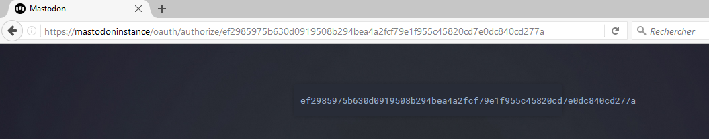

# How to use

## App registration

You need to obtain a ClientId and a ClientSecret for your app, directly from the client, on the target Mastodon instance.
Call the static `CreateApp` method :
```cs
var authClient = new AuthenticationClient("instanceUrl");
var appRegistration = await authClient.CreateApp("Your app name", Scope.Read | Scope.Write | Scope.Follow);
```
The `appRegistration` object must be saved.

## User login, using e-mail and password

Now you can connect the user (not recommended, prefer OAuth when you can) :
```cs
var auth = await authClient.ConnectWithPassword("email", "password");
```
## User login, using OAuth

The recommended way to login is to use OAuth. You open a web browser and let the user login himself on his instance. 
```cs
var url = authClient.OAuthUrl();
OpenBrowser(url);
```
You can either embed a WebView in you app, or open an external browser. When the user allowed your app to access its account, he is redirected to a web page with an auth code.

You have several option to get the code :

  - Ask the user to copy and paste it in your app (easy for you, but not user-friendly)
  - If you have embedded a WebView in your app, you can read the final page. The code is in the url, and in the webpage embedded in a `<code>` tag  
	

If you are in a web context, you can set the final page url, and the user will be redirected directly to your server with the code. Just add your url to the `OAuthUrl` method.
```cs
var url = authClient.OAuthUrl(myRedirectPage);
```
Now this code will let you get the access token for the user
```cs
var auth = await authClient.ConnectWithCode(authCode);
```
## Connect with existing authentication token

When you have the access token, you should save it in the app, and use it every time you restart the app. You just need to add it to the MastodonClient constructor.
```cs
var client = new MastodonClient(appRegistration, auth);
```
Now you can call all the API methods. [Mastonet API](https://github.com/glacasa/Mastonet/blob/master/API.md) [Mastodon API overview](https://github.com/tootsuite/documentation/blob/master/Using-the-API/API.md)

# Streaming

You can use the `TimelineStreaming` to be notified for every status, notification and deletion on a timeline.
```cs
var client =  new MastodonClient("instance", appRegistration, auth);
var streaming = client.GetUserStreaming();

// Register events
streaming.OnUpdate = OnStatusReceived;
streaming.OnNotification = OnNotificationReceived;
streaming.OnDelete = OnDeleteReceived;

// Start streaming
streaming.Start();


// ...

// Stop streaming
streaming.Stop();
```
# Connection issues with .net framework

Some instances only accept TLS 1.2 requests, but .net Framework only support TLS 1.2 by default on version 4.6 and above
If you are on version 4.5.2 or earlier, you should force using TLS 1.2 by this line of code before any request :
```cs
ServicePointManager.SecurityProtocol = SecurityProtocolType.Tls12;
```
